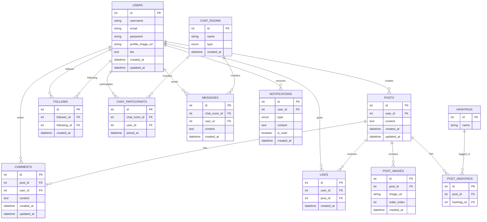

# 🌟 SNS 웹 애플리케이션 개발 프로젝트

## 📌 프로젝트 개요
이 프로젝트는 현대적인 소셜 네트워킹 서비스(SNS) 웹 애플리케이션을 개발하는 것을 목표로 합니다. 사용자 간의 소통, 콘텐츠 공유, 실시간 채팅 등 다양한 기능을 제공하여 사용자 경험을 극대화하고자 합니다.

## 🛠 기술 스택

- **백엔드**: 
  - Spring Boot 3.x
  - Java 17
- **데이터베이스**: 
  - MySQL 8.x
  - Redis (캐싱)
- **ORM**: Spring Data JPA
- **보안**: 
  - Spring Security
  - JWT (JSON Web Tokens)
- **인증**: OAuth2 (Google, Kakao)
- **실시간 통신**: 
  - WebSocket
  - STOMP
- **API 문서화**: Swagger/OpenAPI 3.0
- **빌드 도구**: Gradle
- **버전 관리**: Git, GitHub
- **CI/CD**: GitHub Actions

## 🔑 주요 기능

1. **사용자 관리**
   - 회원가입 및 로그인 (이메일, 소셜 로그인)
   - 사용자 프로필 관리 (CRUD)

2. **게시물 관리**
   - 게시물 작성, 조회, 수정, 삭제
   - 이미지 업로드
   - 페이지네이션 / 무한 스크롤

3. **소셜 상호작용**
   - 좋아요 기능
   - 댓글 시스템
   - 팔로우/언팔로우

4. **실시간 채팅**
   - 1:1 채팅
   - 그룹 채팅
   - 오픈 채팅방

5. **검색 기능**
   - 사용자 검색
   - 게시물 검색
   - 해시태그 검색

6. **알림 시스템**
   - 실시간 알림 (새 팔로워, 좋아요, 댓글 등)

## 📅 개발 일정

- **총 개발 기간**: 1개월 (2024-07-08 ~ 2024-08-18)

### 주차별 계획

1. **1주차**: 프로젝트 초기화 및 기본 설정
   - 요구사항 분석 및 프로젝트 설계
   - 개발 환경 구축
   - 데이터베이스 스키마 설계

2. **2주차**: 핵심 기능 개발 I
   - 사용자 관리 기능 구현
   - OAuth2 소셜 로그인 연동
   - 게시물 관리 기능 구현

3. **3주차**: 핵심 기능 개발 II
   - 소셜 상호작용 기능 구현
   - 실시간 채팅 시스템 개발
   - 검색 및 알림 기능 구현

4. **4주차**: 마무리 및 품질 관리
   - 테스트 작성 및 실행
   - 성능 최적화
   - API 문서화
   - 배포 준비 및 최종 점검

## 🎯 프로젝트 목표

1. 사용자 친화적이고 직관적인 인터페이스 제공
2. 안전하고 확장 가능한 백엔드 아키텍처 구축
3. 실시간 기능을 통한 사용자 경험 향상
4. 클린 코드 및 best practices 적용
5. 철저한 테스트를 통한 안정성 확보

## 📊 ERD (Entity Relationship Diagram)




## 📝 커밋 컨벤션

우리 프로젝트는 다음과 같은 커밋 컨벤션을 따릅니다:

### 커밋 메시지 구조

```
<이모지> <type>(<scope>): <subject>
```

### 커밋 타입 (Type)

- ✨ `feat` : 새로운 기능 추가
- 🐛 `fix` : 버그 수정
- 📚 `docs` : 문서 내용 변경
- 💎 `style` : 코드 포맷팅, 세미콜론 누락, 코드 변경이 없는 경우
- ♻️ `refactor` : 코드 리팩토링
- ✅ `test` : 테스트 코드 추가 및 수정
- 🔧 `chore` : 빌드 관련 파일 수정, 패키지 매니저 설정 등 (프로덕션 코드 변경 X)

### 범위 (Scope)

커밋이 영향을 미치는 범위를 명시합니다. (예: auth, user, post 등)

### 제목 (Subject)

- 변경 사항에 대한 간결한 설명
- 현재 시제의 명령문 사용
- 첫 글자는 대문자로 시작
- 끝에 마침표(.) 사용하지 않음

### 예시

```
✨ feat(auth): 구글 소셜 로그인 기능 추가

- OAuth2 클라이언트 설정 추가
- 구글 로그인 버튼 및 핸들러 구현
- 인증 후 JWT 토큰 발급 로직 구현

해결: #123
```

### 추가 커밋 타입 (선택사항)

- 🔒️ `security` : 보안 관련 수정
- 🚀 `perf` : 성능 개선
- 🎨 `ui` : UI/스타일 파일 추가/수정
- 🔥 `remove` : 파일을 삭제하는 작업만 수행한 경우
- 🚚 `rename` : 파일 혹은 폴더명을 수정하거나 옮기는 작업만 한 경우
- 🔀 `merge` : 다른 브랜치를 merge 하는 경우
- 👷 `ci` : CI 관련 설정 수정
- 📦 `build` : 빌드 관련 수정

### 주의사항

- 한 커밋에는 한 가지 논리적 변화만 담기
- 여러 개의 작은 커밋이 한 개의 큰 커밋보다 낫습니다
- 커밋 메시지는 영어 또는 한글로 일관성 있게 작성
